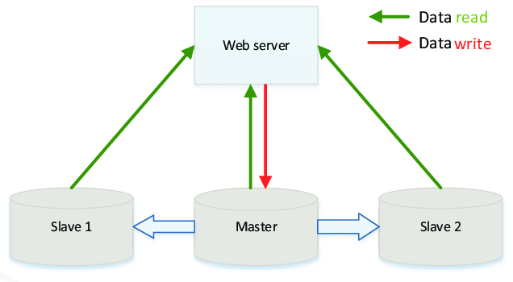
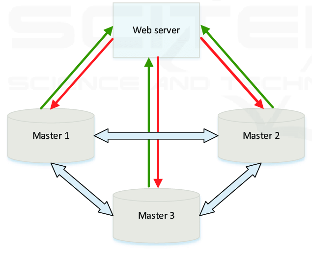
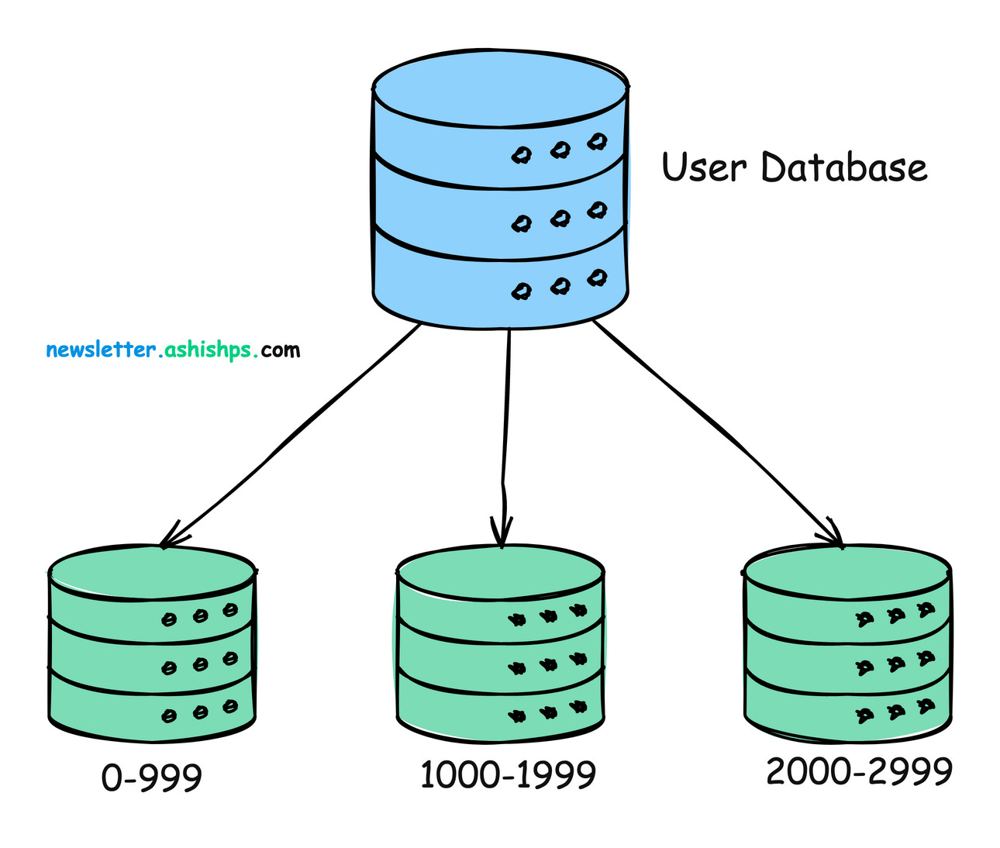

# Подходы к повышению отказоустойчивости БД

## 1)Master-Slave схема

*Figure 1: Master-Slave Architecture*

Главный узел обрабатывает операции записи, а вторые узлы реплицируют данные для операций чтения.

## 2)Master-Master схема

*Figure 2: Master-Master Architecture*

Все узлы действуют как главные базы данных, позволяя выполнять чтение и запись на любом узле, которые затем копируются на другой.

## 3)Сравнение двух вариантов
| Feature                | Master-Slave Replication                    | Master-Master Replication                                     |
|------------------------|---------------------------------------------|---------------------------------------------------------------|
| **Write Operations**    | Only on the master                          | On any master                                                 |
| **Read Operations**     | On slaves                                   | On any master                                                 |
| **Replication Direction** | One-way (master ? slaves)                   | Two-way (masters ? masters)                                   |
| **Conflict Handling**   | None                                        | Required for write conflicts                                  |
| **Scalability**         | Read scalability only                       | Write and read scalability                                    |
| **Failover Complexity** | Difficulties with proper promotion of slave | Easy automatic failover possible                              |
| **Consistency (Latency)** | Generally consistent, with lag              | Potential consistency issues, resolved by conflict resolution |
| **Complexity**          | Simpler to set up and manage                | More complex due to conflict resolution and synchronization   |

## 4)Synchronous vs Asynchronous реплицирование
* Synchronous
Записи подтверждаются только после репликации на все узлы, что обеспечивает более надежные гарантии согласованности во вред производительности.
* Asynchronous
Записи подтверждаются немедленно, а репликация выполняется позже, что повышает производительность, но создает риск потери данных в случае сбоя и есть возможность чтения неактуальных данных.

## 5)Sharding
Объединяет разделение (шардинг) с репликацией на нескольких узлах, каждый из которых отвечает за часть данных.

Хорошее объяснение: [https://aws.amazon.com/what-is/database-sharding/](https://aws.amazon.com/what-is/database-sharding/)

*Figure 3: Sharding*
### Виды шардинга
* Сегментирование на основе диапазона
* Хэшированное сегментирование
* Сегментирование каталогов
* Геосегментирование